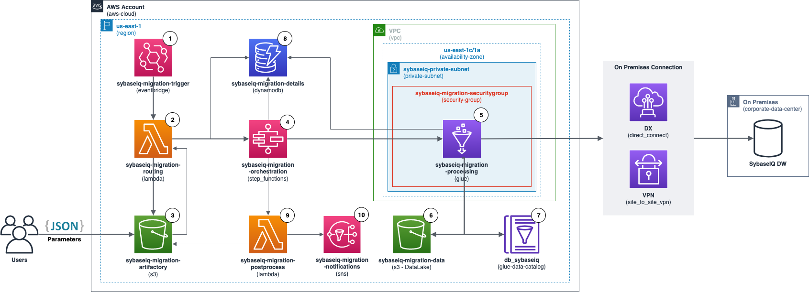

# SAP SybaseIQ Migration to a DataLake on AWS with fine-grained control
This platform aims to provide a way to migrate a SybaseIQ database to a DataLake on AWS with fine-grained control. The objective is to control the impact of the migration on the database.  Instead of doing a single large migration, the platform provides a mean to perform small extractions that can happen in parallel or in sequence. Moreover, the customer does not have to write code, all the extractions are done using parameters on a JSON file that needs to be build according to a migration plan for a specific table. In this JSON the customer is capable of defining what and how much data to extract using SQL, also it is possible to control the parallelism of the extraction. For example, if migrating 100-million-row table impacts the database and its daily users too much, the customer would be able to perform this with 10 smaller extractions of 10-million rows. In addition, the platform catalogs the data, so it is available to be queried right after the end of an extraction.
The main services used are: AWS Glue, Amazon S3, AWS Step Functions, Amazon EventBridge, AWS Lambda, Amazon DynamoDB, and Amazon Simple Notification Service.


## Architecture 

1. An Amazon EventBridge starts the process on a schedule. This automated process allows the extractions to occur at a specific time such as at night and on weekends without any manual action. 
2. An AWS Lambda Function that takes the JSON parameters on S3 and starts an AWS Step Functions state machine. 
3. Amazon S3 bucket where the JSON parameters for each extraction must be put. The JSON files located on the run_on_schedule prefixes will start extractions at the times defined on Amazon EventBridge and the files on the prefix run_now will trigger an extraction right away by invoking the routing AWS Lambda Function through S3 Event Notifications.
4. An AWS Step Functions state machine to orchestrate the extraction. This state machine initiates the Glue Job and monitors it to catch errors and to start the next extraction (if any).
5. An AWS Glue Job responsible for pulling the data from SAP SybaseIQ. This job also partitions, cleans (possible duplicates and blank spaces in the beginning and end of string columns), catalogs, and stores the data on Amazon S3. 
6. DataLake Amazon S3 bucket where all the files from the migration are stored in .parquet.
7. AWS Glue Catalog where the tables migrated are cataloged, allowing the use of services such as Amazon Athena and Amazon Redshift Spectrum to make queries on these migrated tables.
8. Amazon DynamoDB table with metadata about all the extractions.
9. Post process AWS Lambda function that prepares the e-mail to be sent via Amazon SNS, also this function moves the JSON files to the succeeded or failed prefixes on S3 based on the result of the extraction execution.
10. Amazon SNS topic that sends the e-mail when the extraction ends. 

## Extraction configuration JSONs
These JSONs define how the migration will happen. Each JSONs can have one or multiple queries in order to divide the migration into smaller extractions.
Here is an example to extract half of the Tableau superstore table:

```json
{
    "SourceName": "sybaseiq",
    "SourceDatabase": "iqdemo",
    "SourceSchema": "dba",
    "SourceTable": "tb_tableau_superstore",
    "Active": true,
    "SequentialMultipleParts": false,
    "Query": "SELECT * FROM iqdemo.dba.tb_tableau_superstore WHERE [Row ID] <= 4997",
    "ExpectedAmountOfRecords": 4997,
    "NumPartitions": 8,
    "LowerBound": "1",
    "UpperBound": "4997",
    "ColumnForPartitioningOnS3": "order_date",
    "ColumnForPartitioningOnSpark": "Row ID",
    "JobName": "sybaseiq_extractor",
    "WorkerType": "G.1X",
    "NumberOfWorkers": 3,
    "MigrationPart": 1,
    "JDBCConnectionString": "jdbc:sybase:Tds:[IP_ADDRESS]:2638?ServiceName=iqdemo",
    "CredentialsSecretArn": "arn:aws:secretsmanager:[AWS_REGION]:[AWS_ACCOUNT_NUMBER]:secret:test/databases/sybase-m0INkQ"
}
```
It is possible to create several of these file and run them in parallel.
Also, to have less impact on the database, it is possible to create a JSON to run the extractions in sequence. It can have many queries and one query will start when the previous one ends.
```json
{
    "SourceName": "sybaseiq",
    "SourceDatabase": "iqdemo",
    "SourceSchema": "dba",
    "Active": true,
    "SequentialMultipleParts": true,
    "Jobs": [
                {
                    "SourceTable": "tb_tableau_superstore",
                    "Query": "SELECT * FROM iqdemo.dba.tb_tableau_superstore WHERE [Row ID] <= 4997",
                    "ExpectedAmountOfRecords": 4997,
                    "NumPartitions": 8,
                    "LowerBound": "1",
                    "UpperBound": "4997",
                    "ColumnForPartitioningOnS3": "order_date",
                    "ColumnForPartitioningOnSpark": "Row ID",
                    "JobName": "sybaseiq_extractor",
                    "WorkerType": "G.1X",
                    "NumberOfWorkers": 3,
                    "MigrationPart": 1,
                    "JDBCConnectionString": "jdbc:sybase:Tds:[IP_ADDRESS]:2638?ServiceName=iqdemo",
                    "CredentialsSecretArn": "arn:aws:secretsmanager:[AWS_REGION]:[AWS_ACCOUNT_NUMBER]:secret:test/databases/sybase-m0INkQ"
                },
                {
                    "SourceTable": "tb_tableau_superstore",
                    "Query": "SELECT * FROM iqdemo.dba.tb_tableau_superstore WHERE [Row ID] > 4997",
                    "ExpectedAmountOfRecords": 4997,
                    "NumPartitions": 8,
                    "LowerBound": "4998",
                    "UpperBound": "9994",
                    "ColumnForPartitioningOnS3": "order_date",
                    "ColumnForPartitioningOnSpark": "Row ID",
                    "JobName": "sybaseiq_extractor",
                    "WorkerType": "G.1X",
                    "NumberOfWorkers": 3,
                    "MigrationPart": 2,
                    "JDBCConnectionString": "jdbc:sybase:Tds:[IP_ADDRESS]:2638?ServiceName=iqdemo",
                    "CredentialsSecretArn": "arn:aws:secretsmanager:[AWS_REGION]:[AWS_ACCOUNT_NUMBER]:secret:test/databases/sybase-m0INkQ"
                }
    ]
}
```
* **SourceName** _[string]_: the name of the database engine that the data is coming from
* **SourceDatabase** _[string]_: the name of the database inside the engine where the table resides
* **SourceSchema** _[string]_: the name of the schema inside the engine where the table resides
* **SourceTable** _[string]_: the name of the table being migrated 
* **Active** _[boolean]_: 
    - 'true': this json should be considered in the migration
    - 'false': this json should not be considered in the migration
* **SequentialMultipleParts** _[boolean]_: 
    - 'true': this json has multiple extractions to be run in sequence
    - 'false': this json has only one extraction
* **Query** _[string]_: the query that specifies the data that has to be extracted. **Do not** end the query statement with '**;**'
* **ExpectedAmountOfRecords** _[integer]_: the amount of records (rows) expected to be extracted with the query. This information is later used to compare how many rows were actually extracted. 
* **NumPartitions** _[integer]_: how many partitions spark should use to pull the data from the database. These partitions pull the data in parallel, opening concurrent JDBC connections, make sure that the database user have permissions to open multiple sessions. Also, refer to [Spark JDBC Documentation](https://spark.apache.org/docs/latest/sql-data-sources-jdbc.html)
* **LowerBound** _[string]_: the minimum value of the *ColumnForPartitioningOnSpark* that spark should use to calculate which part of the table each partition will process. Refer to [Spark JDBC Documentation](https://spark.apache.org/docs/latest/sql-data-sources-jdbc.html)
* **UpperBound** _[string]_: the maximum value of the *ColumnForPartitioningOnSpark* that spark should use to calculate which part of the table each partition will process. Refer to [Spark JDBC Documentation](https://spark.apache.org/docs/latest/sql-data-sources-jdbc.html)
* **ColumnForPartitioningOnS3** _[string]_: reference column to partition the data on Amazon S3
* **ColumnForPartitioningOnSpark** _[string]_: the same as *partitionColumn* on spark documentation ([Spark JDBC Documentation](https://spark.apache.org/docs/latest/sql-data-sources-jdbc.html)). This column is used as a reference for spark to calculte which parts of the table each partition has to process. This column on the database must be an Integer, Date or Timestamp/Datetime
* **JobName** _[string]_: the name of the AWS Glue Job that will process the extraction
* **WorkerType** _[string]_: AWS Glue worker type. Refer to [AWS Glue Jobs](https://docs.aws.amazon.com/glue/latest/dg/aws-glue-api-jobs-job.html)
* **NumberOfWorkers** _[integer]_: number of AWS Glue Workers to process the extraction. 1 worker is taken to be the master. This parameter should be proportional to the *NumPartitions*. Each worker can process up to 4 spark partitions in this JDBC connection, so make sure that the number of workers follows this: _NumberOfWorkers = (NumPartitions/4) + 1_. However, it is important to keep in mind that spark puts all the data on the RAM memory to process, so depending on the density of data on each partition a memory overflow can happen. In this situation it is possible to calculate the NumberOfWorkers this way: _NumberOfWorkers = (NumPartitions/2) + 1_. Also, it is possible to select a *WorkerType* with more memory. 
* **MigrationPart** _[string]_: reference column of the migration plan. If the migration is divided into 10 parts, you can use this field to keep track of which part this query corresponds to
* **JDBCConnectionString** _[string]_: the JDBC connection string. Make sure this follows [SAP documentation](https://infocenter.sybase.com/help/index.jsp?topic=/com.sybase.infocenter.dc00800.1520/html/iqapgv2/Choosing_jdbc_jdbc.htm). Moreover, make sure you are using a compatible JDBC driver. This platform has been tested against SAP SybaseIQ 16.1.040.1549 using jConnect 7.00 (build 26502 and JDK16)
* **CredentialsSecretArn** _[string]_: the Arn of the AWS Secrets Manager secret containg the user and password to be database. When storing the secret, use the option *Other type of secret* and *Key/value*


## Instalation 
1. A VPC with a route to the database must exist before this platform can be used
2. On the CloudFormation folder run the template1.yaml on the AWS CloudFormation console. Make sure your role has sufficient permissions to create an Amazon S3 bucket. A new bucket starting with *assets-sybaseiq-migration* will be created.
3. Clone this repo in your local machine
4. Download the SAP jconnect [drive](https://help.sap.com/docs/SAP_ASE_SDK/e12c539de04b44a0bb17a545a148361c/b03e2db6bbf910148fc6bbe092513290.html?version=16.0.3.0) and put it on */Assets/sybaseiq/glue/extractor/jars/* folder
5. Zip the files with the lambda codes and leave them in the same path with the same name of the .py files. You will create these two files:
    - Assets/sybaseiq/lambdas/routing/lambda_function.zip
    - Assets/sybaseiq/lambdas/postprocess/lambda_function.zip
5. Drag and drop the */Assets/sybaseiq/* folder into the bucket that has been created. It is important to drag and drop in order to keep the folder structure
6. Run the template2.yaml on the AWS CloudFormation console. Carefully read the descriptions of each parameter that you have to pass to AWS CloudFormation
7. Go to the AWS Glue job and check if the **Dependent JARs path** is correctly pointing to the jar file you previously downloaded
8. Create a JSON to test an extraction, go to the *migration-plans* bucket and upload the json into the *run_now* folder. Then check on AWS Step Functions console if the process has started


